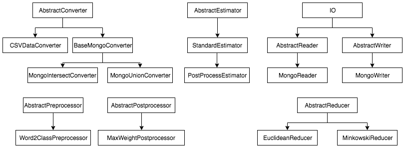

# Prediction model

Prediction model is the package the main goal of which is to calculate
weighted sum of values based on the history of how close these values
are to the truth ones.

For now, it contains developed functionality to work with weather
data that is laid in `MongoDB` database, but due to its multilayer
independant structure this could be extended to other data systems.

## Usage

#### Usage as application

First of all, if you want to use this package as application, it
contains `run_model.py` script that works with weather data. Lest's look
at the example:

```
python run_model.py REDUCE -c /path/to/cities/list.txt -m 7 -l 30
```

You might already guessed the command line arguments but it's better to
explain them more detailed:

* **first positional argument**: first argument is positional and necessary.
It can take values: `REDUCE|PRODUCE`. Use `REDUCE` to reduce weights
and write them to Mongo; use `PRODUCE` to calculate new  weather for
the latest data in DB limited by `--limit` or `-l`
* **-c --cities**: path to list of cities, or city names separated
by whitespaces: `--cities=Kiev Moscow` or `-c /path/to/cities/list.txt`
* **-m --max**: max forecast distance for which to reduce weights, i. e.
`for 0:max`. Default is 0
* **-l --limit**: limit the amount of values that are used in weights
reducing, i. e. how much data to use to train new weights. Default 7

This script writes data to local instance of `MongoDB`, `weather_db`
database (standard database) in such collections:

* `weights` - collection where weights are stored
* `errors` - collection that contains errors calculated via Euclidian
metrics by default (also, possible to calculate via Minkowski's one)
* `predicted_data` - collection with new predicted data for
weather services with the latest `weights`

When script is run with `REDUCE` command it writes new weights to
`weights` collection; `PRODUCE` writes data to `predicted_data` and
`errors`.

#### Usage as package

Read about package structure more in [Details](#head1). This
subparagraph contains only surface information and describes only usage
practice.

The first thing you should know: package consists of several parts:

* `Convertors` - classes that convert data from arbitrary formats to
specific format that should be fed to `Estimator`
* `Reducers` - classes that specify target functions for estimators
* `Preprocessors` - classes that preprocess data before convertation
(commonly used in converters)
* `Postprocessors` - classes that postprocess data after estimations
(it's still in idea step, used nowhere yet)
* `Estimators` - are the workhorses of package. It "reduces" errors
(weights) and "produce" new data
* `io`:`readers/writers` - are the functionality to read data
(`weights`, `errors`, `produced data`) and write it from specified
estimator format to any arbitrary one (such as `MongoDB`)
* `Utils` - all the other stuff that is necessary but we don't know
where to put it

As we work with weather data saved into `MongoDB` the following
instruction will contain examples and explanations how to work with
classes created by `MongoDB` <-> `StandardEstimator` bridge.

Let's look at the reducing process first.

First of all we should create converter. We can use `MongoIntersectConverter`

```python
from applib.converters import MongoIntersectConverter
from applib.estimators import StandardEstimator, Reducer


city = 'Kiev'
disntance = 0
limit = 7

converter = MongoIntersectConverter.from_mongo(mongo_uri=MONGO_URI,
                                               mongo_db=MONGO_DB,
                                               data_collections=('accuweathercom',
                                                                 'weathercom'),
                                               real_collection='actual_weather',
                                               city=city,
                                               distance=disntance,
                                               limit=limit)
```

where
* `mongo_uri` - mongo URI (local instance),
* `mongo_db` - mongo database (`weather_db`),
* `data_collections` - names of collections for which to calculate weights,
* `real_collection` - name of collection containing actual data,
* `city` - city for which to calculate weights,
* `forecast_distance` - weather forecast distance for which to calculate
weights,
* `limit` - limit the amount of data that would be used in weights
reducing process.

`from_mongo` method sorts data via `weather_date` field from the
newest to the oldest ones.

Then you can explicitly call `convert(KEY_MAP)` method of `MongoIntersectConverter`
or use `StandardEstimator`'s functionality:

```python
data_to_predict, real_data = converter.convert(KEY_MAP)
estimator = StandardEstimator(data_to_predict, real_data)
```

or

```python
estimator = StandardEstimator.from_converter(converter, KEY_MAP)
```

Actually, it is adviced to use `from_converter` method, instead of
explicit constructor call.

The above is also true for `MongoIntersectConverter`. It is highly adviced
to use `from_mongo` class method because if you want to explicitly use
constructor you need to provide `MongoDB` queries that is even hard to
imagine.

Also, there wasn't sayd a word about `KEY_MAP` object. What is it, you may ask?
It's easy. In two words `KEY_MAP` object must have the following structure:

```
KEY_MAP = {
    'key_that_will_be_used_in_package': (
        ('corresponding_key_in_mongo',
         'corresponding_subkey_in_mongo',
         'corresponding_subsub_key...',
         ...),
        (PreprocessorClassOne,
         PreprocessorClassTwo,
         ...)
    )
}
```

for example,

```python
KEY_MAP = {
    't_min': (
        ('temperature', 'min'),
    ),
    't_max': (
        ('temperature', 'max'),
    ),
    'class': (
        ('description',),
        (Word2ClassPreprocessor(CHECK_WORDS),)
    ),
}
```

After estimator is built you can simply "reduce" the weights

```python
estimator.reduce(EuclideanReducer())
```

`Reducer` is something new here. You need to pass some `AbstractReducer`
child class instance to reduce method of estimator.

After weights were reduced what can we do? Right, we can write them
somewhere. So, how about `MongoDB`?

```python
# Creating MongoWriter instance
writer = MongoWriter(MONGO_URI, MONGO_DB)

# Add suplementary information that will be written to mongo document
writer.supplement({'city': city, 'forecast_distance': distance})

# Write weights of above estimator
writer.write_weights(estimator)
```

Now, you can check your local `MongoDB` instance, `weather_db` database,
`weights` collection.

The weights are reduced and it is possible to produce new data and
errors. It can be done either via existing estimator or `io.readers...`
API, let's look at both these ways:

Directly via existing in memory estimator

```python
# Get converted data
predict_data, _ = converter.get()

# Produce new for this data
result = estimator.produce(predict_data)
```

Or via `estimators.produce` function if there is no need to
create estimator object. But in this case you should use one of the
readers, for example, `MongoReader`

```python
# Create MongoReader instance
reader = MongoReader(MONGO_URI, MONGO_DB)

# Specify search conditions by which to search data in mongo collection
# This is necessary step
reader.search(city, distance)

# Produce new
predict_data, _ = converter.get()
res = estimators.produce(reader, predict_data)
```

Now you can write produced data to mongo collection

```python
# Don't forget to add supplementary information
writer.supplement({'city': city, 'forecast_distance': d})

# And just call write_produced method of writer
writer.write_produced(res)
```

In order to calculate error of prediction just call `estimators.cv`
function. It calculates the error by N-fold cross-validation by the
presented metrics

```python
_, real = converter.get()
cv_error = applib.estimators.cv(res, real, Reduce.L2)

# Write errors to mongo
writer.write_errors(cv_error)
```

Let's look on the `produced_data` and `errors` collections.

## <a id="head1"></a>Details

### Structure

As it was said above the package consists of these independent parts:

#### Converters

The functionality that converts data from one format (for example, MongoDB)
to specific format that is used by `Estimators`.

Their base class is `AbstractConverter`. When you create new converter,
the class `AbstractConverter` must be extended.

Base class for mongo converters is `BaseMongoConverter`.

Right now there are two converters:

* `TestDataConverter` - works with test weather data saved in `.csv`.
In future versions could be renamed to CSVConverter
* `MongoIntersectConverter` - works with weather data that is stored into
mongo by weather scrapers. This converter looks only for data that exists
in ALL slots by some label (in example, `weather_date`)
* `MongoUnionConverter` - This one is the same as above except this
converter extracts all data for slots and union it. If some value is
`None` it assigns first non-null value for the same label (for example,
`weather_date`)

#### Estimators

Estimators are workhorses of the library, its core. They "reduce"
(calculate) weights, "produce" new data, etc.

Their base class is `AbstractEstimator`. When you create new estimator,
the class `AbstractEstimator` must be extended.

There is one estimator:

* `StandardEstimator` - this estimator calculates weights as errors
between service data and real one using L1, L2 metrics

#### Reducers

Reducers defines target functions by which distance between true values
and predict values should be calculated.

The base class for reducers is `AbstractReducer`.

Right now, there are two reducers `EuclideanReducer` and `MinkowskiReducer`.

#### Preprocessors

Preprocessors are here to preprocess data before post them to estimators.

Base class is `AbstractPreprocessor`.

There is only one preprocessor:

* `Word2ClassPreprocessor` - parses sentence, for example,
`There would be huuuuge rain` to append it to specific class from
classes `dict` that is passed to `Word2ClassPreprocessor` constructor,
for example,

```python
{
    'sun': 1,
    'cloud': 2,
    'rain': 3,
    'shower': 4,
    'thunderstorm': 5,
    'fog': 6,
    'snow': 7,
}
```

where key is the word that would be looked for and value is class value

#### Postprocessors

There are no postprocessors yet.

#### IO:Readers

The classes and functions that read estimator data from different formats
to estimator specific format.

Their base class is `AbstractReader`. Extend it to create new reader.

There is one readers:

* `MongoReader` - reads estimator specific data from mongo collections

#### IO:Writers

The classes and functions that write estimator data to different places
and formats.

Base class is `AbstractWriter`. Extend it to create new writer.

There is one writer:

* `MongoWriter` - writes estimator specific data to mongo collections


### Structure diagram




### Data flow

Let's take a little look on the estimator data format. So, what is
returned by this line?

```python
data_to_predict, real_data = converter.convert(KEY_MAP)
```

Schematically `data_to_predict` looks like

```
data:
    key1: [
                [1, 3, 4, 5, 3, 2, 8]
                [1, 8, 7, 6, 5, 4, 3]
                [1, 5, 3, 2, 2, 1, 4]
           ]
    key2:  [
                [10, 13, 14, 15, 13, 12, 18]
                [11, 18, 17, 16, 15, 14, 13]
                [11, 15, 13, 12, 12, 11, 14]
           ]
    ...
labels: ['1.03.2029', '2.03.2029', '3.03.2029', '4.03.2029', '5.03.2029', '6.03.2029', '7.03.2029']
slots:  ['first', 'second', 'third']
```

`data` key consists of named by `keyi` matrices. Each row in matrix
contains values collected by specific service.

`labels` is "names" of matrices columns.

`slots` is "names" of matrices rows.

Analogously, `real_data` would be

```
data:
    key1: [
                [2, 3, 4, 5, 9, 2, 8]
           ]
    key2:  [
                [11, 13, 14, 17, 13, 12, 18]
           ]
    ...
labels: ['1.03.2029', '2.03.2029', '3.03.2029', '4.03.2029', '5.03.2029', '6.03.2029', '7.03.2029']
slots:  ['real']
```

But matrices in `real` will only contain one row with real data.

For example, weather data of our scrapers from mongo would have the next
look

`data_to_predict`:

```
data:
    t_min: [
                [1, 3, 4, 5, 3, 2, 8]
                [1, 8, 7, 6, 5, 4, 3]
           ]
    t_max:  [
                [10, 13, 14, 15, 13, 12, 18]
                [11, 18, 17, 16, 15, 14, 13]
           ]
labels: ['1.03.2029', '2.03.2029', '3.03.2029', '4.03.2029', '5.03.2029', '6.03.2029', '7.03.2029']
slots:  ['accuweathercom', 'weathercom']
```

So, for example, let's take a look on `data:t_min[0]` (first row of first
matrix): `[1, 3, 4, 5, 3, 2, 8]`. We know that `labels` is the names
of columns, so first element in column `1` is the min temperature for
`1.03.2029`, `3` - `2.03.2029`. Also, we already know that `slots` is
the names of rows, so data:t_tim[0], i. e. `[1, 3, 4, 5, 3, 2, 8]` is
the data gathered by `accuweathercom` service.

`real_data` then would be:

```
data:
    t_min: [
                [-1, 2, 1, 8, 4, 1, 2]
           ]
    t_max:  [
                [-1, 2, 1, 8, 4, 1, 2]
           ]
labels: ['1.03.2029', '2.03.2029', '3.03.2029', '4.03.2029', '5.03.2029', '6.03.2029', '7.03.2029']
slots:  ['actual_weather']
```

**NOTE** that for existing `StandardEstimator` provided data should be
homoheneous, i. e. the amount of columns must be equal in all rows; so,
this

```
...
 t_min: [
                [1, 3, 4, 5, 3, 2, 8]
                [1, 8, 7, 6]
           ]
...
```
will generate error!

### Adding new features

In order to add new feature (new estimator, or converter, etc), you must
extend appropriate `Abstract...` class. Then combine this feature with
existing API.
